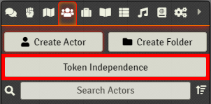
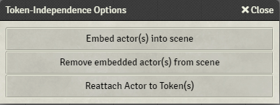
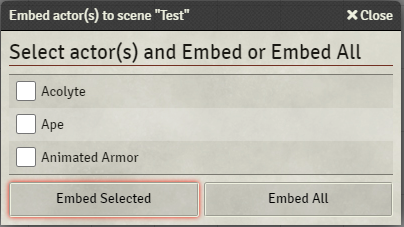
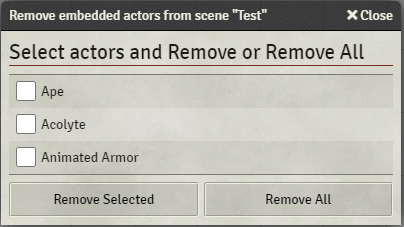
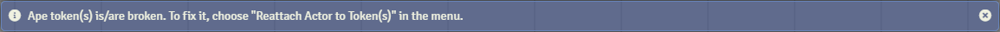
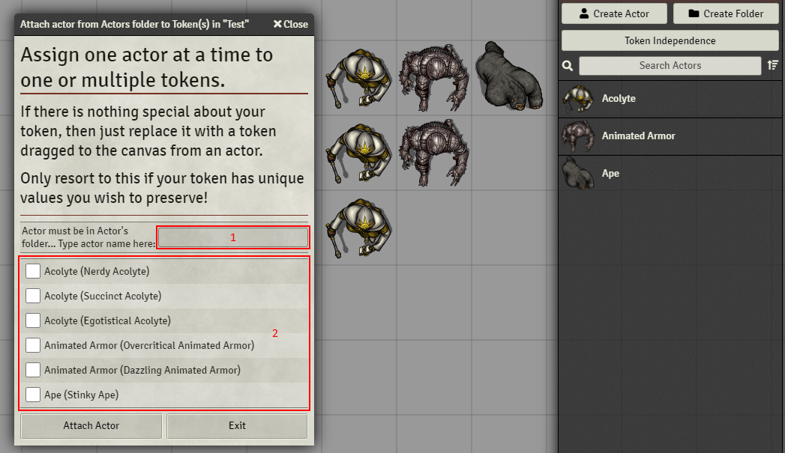

# FoundryVTT - Token-Independence
[)].download_count&url=https://api.github.com/repos/ggagnon76/token-independence/releases/latest&color=green)](https://github.com/ggagnon76/token-independence/releases/latest)

**[Compatibility]**: *FoundryVTT* 0.7.9  
**[Systems]**: *D&D5e*  
**[Languages]**: *English*  

This module allows a GM to populate a scene with tokens from actors and then embed the bare minimum actor data into the scene flags, allowing the module to recreate synthetic actors to implement full functionality without needing the actor in the actor folder.

The populated scenes can be exported, imported, stored in a compendium and pulled out for use at any time, ready to be used instantly.  You can conceivably do all your preparation in a test/prep world, export your finished scene, switch to your game world, import your finished scene and run your game without a single creature in the actor folder.

Content creators that are interested in creating encounters with their homebrew or SRD creatures can fully populate a scene with tokens, allowing a GM to purchase, install and run the scene immediately upon installation!

Version 0.1.0 of this module is built around D&D5e.  If this module is widely adopted and other gaming systems want to build upon it, they may fork the repository on GitHub per the MIT license, or make pull requests.

If for some reason you wish to give ownership of a token to a player, you can import the correct actor into the actor's folder, then use an option in the module's menu to attach the actor to the token.  Once this has been completed, you can assign the actor to the player per usual core functionality.

Should the need arise, it is possible to remove the actor data from the scene flags via the provided menu.

## THEORY
The data stored in the scene doesn't contain the entire structure of an actor in the actors folder, so this module could reduce the data uploaded to clients.  However, if the same actor/creature is embedded in several scenes, which are all in the scenes folder, then those gains could become losses, ie: you'll upload more data than just having the actor in the actors folder in the first place.  

Keep your scenes folder tidy too, store what you don't immediately need in a compendium, and you **SHOULD** see improvements in upload performance.  I say 'should' because this has not been verified.  At all. It's just theory.

## How to use this module

When at least one token from a valid actor is placed into a scene, a button will appear in the actor's UI bar.  

Clicking on this button will create a dialog with up to three buttons.  

In order for the *Embed Actor(s)* option button to appear, three conditions must be met:
 - A token has to be in the scene, that
 - belongs to an actor currently in the actor folder, and
 - the actor can't already be embedded in the scene

By pressing the Embed Actor(s) option button, you will be presented with a list of all the actors that meet those three requirements.  You may choose one, several or embed them all at once.  

In order for the *Remove Embedded Actor(s)* option button to appear, there must be one or more actors embedded in the scene.
By pressing the *Remove Embedded Actor(s)* option button, you will be presented with a list of all the embedded actors.  You may choose one, several or remove them all at once.  

## Bonus feature
If your scene contains a token that has neither an actor in the actor's folder, nor an actor embedded by this module, then you will get a notification when the canvas is drawn.  

When this condition occurs, a third option button will become available, which will allow you to attach (any) actor in the actor's folder to that token.
***NOTE!  The module can't know what is an appropriate actor for your token.  It will just do what you tell it to do.  So if you attach a dragon actor to a goblin token, well you're going to get a frankenstein creature.  For some, this might almost be a feature!?***

By pressing the *Reattach Actor to Token(s)* button, you will be presented with a text box input and a list of all the broken tokens.  

In this example, tokens were created using Token Mold to give them unique names.

The dialog works as follows:
 - Area 2 lists all the broken tokens with selectable checkboxes.  The tokens will be named according to the data in token.data.name, which **should** match the name of the actor that spawned the token, and in parenthesis, the individual token name according to the data in token.actorData.name.
 - Area 1 is where you type the name of the actor, exactly as it is written in the actor's folder.  Whichever tokens have been selected via checkbox(es) will have this actor bound to it!
 - You can only do one actor at a time with this dialog option.

## See the early Proof of Concept in action:

